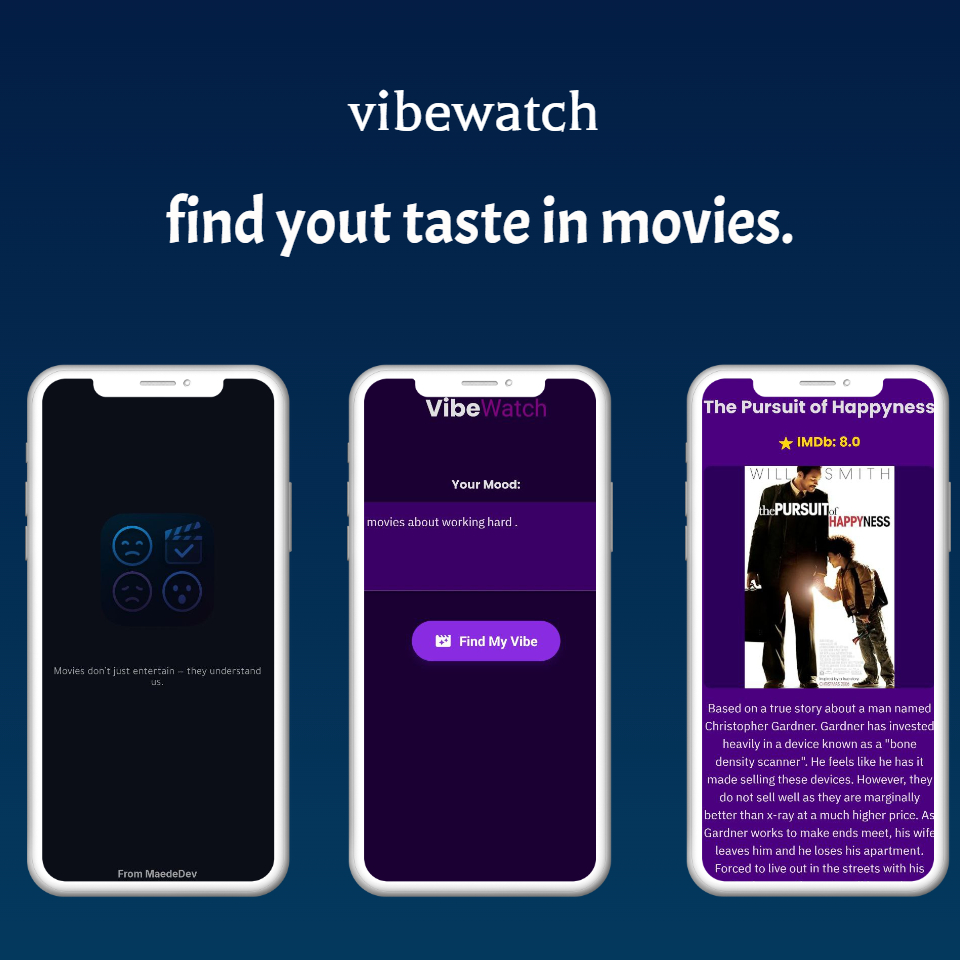

# VibeWatch

## Personalized Movie Recommendations Based on Your Mood

VibeWatch is a mobile application built with React Native that provides movie recommendations tailored to your current mood. Simply describe how you're feeling, and our AI-powered system, integrated with OMDb, will suggest a movie that fits your vibe, complete with details and a plot summary in your preferred language.

## ✨ Features

* **Mood-Based Recommendations:** Get unique movie suggestions by describing your current mood (e.g., "happy and energetic," "sad and reflective," "adventurous").
* **Multi-Language Support:** The app intelligently detects the language of your mood input and provides the movie plot translation in that language (for Arabic, English, etc.).
* **Rich Movie Details:** Fetches comprehensive movie information including title, IMDb rating, and poster from the OMDb API.
* **Smooth UI/UX:** Features subtle animations for a pleasing user experience.
* **Secure API Key Handling:** Utilizes `react-native-config` for managing API keys securely via environment variables.

## 🚀 Technologies Used

* **React Native**
* **TypeScript**
* **OpenAI API (GPT-4o-mini):** For mood-to-movie mapping and plot translation.
* **OMDb API:** For fetching movie details (posters, ratings, plots).
* **`react-native-config`:** For environment variable management.
* **`react-native-vector-icons` (`@expo/vector-icons` for Expo):** For UI icons.
* **Expo (Optional, for Managed Workflow):** If you are using Expo Go.

## ⚙️ Setup and Installation

### Prerequisites

* Node.js (LTS version recommended)
* npm or Yarn
* Git
* (Optional) Expo CLI (`npm install -g expo-cli` or `yarn global add expo-cli` if using Expo managed workflow)




### 1. Clone the Repository

```bash
git clone [https://github.com/isitmaede/VibeWatch.git](https://github.com/isitmaede/VibeWatch.git)
cd VibeWatch
